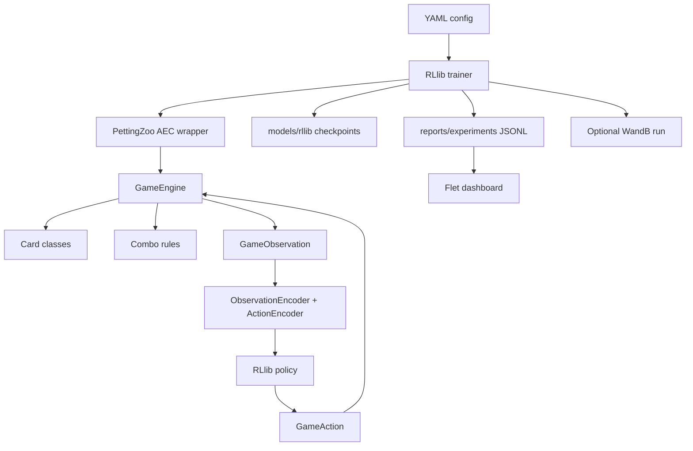
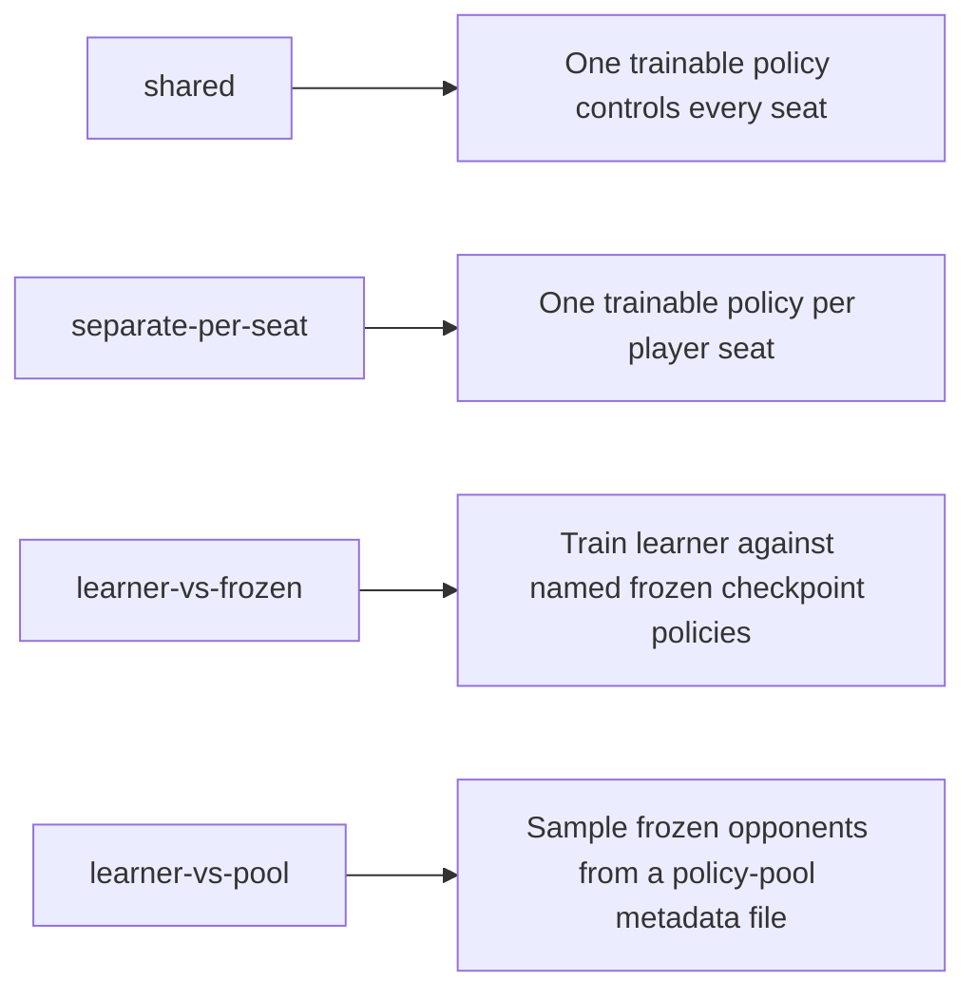

# Exploding Kittens Simulator

A Python learning project for building a card-game engine, giving agents a clean decision interface, and training reinforcement-learning policies to play the game.

This is not an official Exploding Kittens product. It is a simulator inspired by the game and built for experimentation. One card, `alter_the_future`, is custom to this project and is not part of the commercial game.

## Project Status

The project has moved beyond the first pure-Python milestone. The core game engine is tested, agents act through observations and concrete legal actions, PettingZoo and RLlib integration exists, and the current active experiment is a 4-player separate-policy RLlib run with local dashboard logs and optional WandB tracking.

Current highlights:

- Pure Python game engine with explicit `GameAction` objects.
- Card rules live in card classes; combo rules live separately.
- Hidden information boundary for agents.
- Fixed-shape observation encoder and stable integer action encoder.
- PettingZoo AEC wrapper for multi-agent environments.
- Single-agent Gymnasium wrapper for early MaskablePPO experiments.
- RLlib PPO trainer with action masking, shared-policy, separate-per-seat, frozen-policy, and policy-pool modes.
- Terminal-rank rewards for 4-player training.
- Randomized-seat-rank evaluation for measuring general skill rather than only native-seat skill.
- Local experiment logs for the Flet dashboard.
- Optional WandB tracking for online/offline experiment monitoring.

## Quick Start

Install the package and development tools:

```powershell
venv\Scripts\python.exe -m pip install -e ".[dev]"
```

Install everything used by the current training and dashboard workflow:

```powershell
venv\Scripts\python.exe -m pip install -e ".[dev,tracking,training,multiagent,ui]"
```

Run the tests:

```powershell
venv\Scripts\python.exe -m pytest
```

Run a plain simulation from `game_config.yaml`:

```powershell
venv\Scripts\python.exe scripts\run_simulation.py
```

Run a tiny RLlib smoke test:

```powershell
venv\Scripts\python.exe scripts\train_rllib_pettingzoo.py --config configs\rllib_smoke.yaml
```

Open the local dashboard:

```powershell
venv\Scripts\python.exe scripts\dashboard_flet.py
```

## Current Main Experiment

The main longer-running config is:

```text
configs/rllib_separate_per_seat_4p_longer.yaml
```

It is currently set up as:

```yaml
game:
  players: 4
  enabled_combo_rules:
    - two_of_a_kind

reward:
  profile: terminal-rank
  terminal_rank_rewards: [1.0, 0.3, -0.3, -1.0]

model:
  hidden_layers: [64, 64, 64]
  activation: relu

experiment:
  run_name: 4seat_64_relu_150
  evaluation_scope: randomized-seat-rank
  continue_mode: same-run
  wandb_mode: online

policy_setup:
  mode: separate-per-seat
```

Run it with:

```powershell
venv\Scripts\python.exe scripts\train_rllib_pettingzoo.py --config configs\rllib_separate_per_seat_4p_longer.yaml
```

If the run already exists, the trainer asks whether to continue, overwrite, or quit. With `continue_mode: same-run`, choosing continue restores the latest checkpoint, keeps the same run name, appends local dashboard logs, continues checkpoint numbering, and tries to resume the same WandB run id.

## How The Pieces Fit



The important design boundary is that agents do not receive the full engine. They receive a `GameObservation` plus legal concrete actions. The engine remains responsible for rule correctness and hidden information.

## Engine And Rules

The engine supports two or more players. Each player starts with one `Defuse`. The current player may draw or play legal cards/combo actions. The game ends when one player remains.

Implemented deck cards:

| Card | Status |
| --- | --- |
| `normal` | Drawn into hand. |
| `skip` | Ends the current turn without drawing. |
| `attack` | Makes the next player take attack turn debt. |
| `shuffle` | Shuffles the draw pile. |
| `favor` | Takes one random card from a target player's hand. |
| `see_the_future` | Stores temporary knowledge of the top three draw-pile cards. |
| `alter_the_future` | Custom simulator card that reverses the top three draw-pile cards. |
| `defuse` | Prevents elimination after drawing an exploding kitten. |
| `exploding_kitten` | Eliminates the player unless defused. |

Combo rules are separate from cards:

| Combo | Status |
| --- | --- |
| `two_of_a_kind` | Play two cards with the same name and steal one random card from another player. |

Card selection can be configured for focused tests:

```yaml
include_cards:
  - normal
  - skip
exclude_cards:
  - attack
```

`defuse` and `exploding_kitten` are always included.

## Agent Boundary

Agents choose `GameAction` objects, not vague command names. A concrete action carries the exact choices required by the engine:

```python
GameAction(
    kind=Action.PLAY_FAVOR,
    card_indexes=(1,),
    target_player="player_3",
)
```

The observation includes information the agent is allowed to know:

- Exact names of its own hand cards, in hand-index order.
- Own hand counts.
- Visible discard pile counts.
- Draw pile size.
- Living player count.
- Current attack turn debt.
- Known top cards from `see_the_future`.
- Public event kinds.
- Legal concrete actions.

Hidden information stays hidden:

- Draw pile order.
- Other players' exact hands.

Opponent hand sizes are hidden by default. They can be revealed for experiments:

```yaml
reveal_opponent_card_counts: true
```

Agents can inspect which cards each legal action would spend:

```python
for action, card_names in observation.legal_actions_with_card_names():
    ...
```

## Encoders

`ActionEncoder` maps concrete actions to a stable integer action space and produces masks:

```python
encoder = ActionEncoder(max_hand_size=32, max_players=5)
action_id = encoder.encode(action, observation)
action = encoder.decode(action_id, observation)
mask = encoder.action_mask(observation)
```

`ObservationEncoder` converts observations into fixed-shape numeric vectors:

```python
encoder = ObservationEncoder(max_hand_size=32, max_players=5)
encoded = encoder.encode(observation)
vector = encoded["observation"]
mask = encoded["action_mask"]
```

This is the interface used by PettingZoo, Gymnasium, MaskablePPO, and RLlib.

## Running Simulations

`scripts/run_simulation.py` reads `game_config.yaml` by default:

```powershell
venv\Scripts\python.exe scripts\run_simulation.py
```

Command-line values override the YAML:

```powershell
venv\Scripts\python.exe scripts\run_simulation.py --games 100 --players 3 --strategy safe-rule
```

Baseline strategies:

| Strategy | Behavior |
| --- | --- |
| `draw-only` | Always draws. |
| `random` | Randomly chooses among legal actions. |
| `skip-if-possible` | Plays `skip` when available, otherwise draws. |
| `safe-rule` | Uses simple rules, especially when `see_the_future` reveals danger. |

Simulation output includes aggregate diagnostics and per-agent ASCII tables for wins, turns survived, cards played, combos, explosions, defuses, and hand size.

## PettingZoo And Single-Agent Wrappers

Use the PettingZoo AEC environment for multi-agent experiments:

```python
from exploding_kittens import pettingzoo_env

env = pettingzoo_env(players=3, enabled_combo_rules=("two_of_a_kind",))
env.reset(seed=1)

for agent in env.agent_iter():
    observation, reward, termination, truncation, info = env.last()
    if termination or truncation:
        action = None
    else:
        action = env.action_space(agent).sample(observation["action_mask"])
    env.step(action)
```

Run a random PettingZoo rollout:

```powershell
venv\Scripts\python.exe scripts\run_pettingzoo_random.py --players 3 --seed 4 --enabled-combo-rules two_of_a_kind
```

Use `SingleAgentEnv` when one learner should play against scripted opponents:

```python
from exploding_kittens import SingleAgentEnv

env = SingleAgentEnv(
    players=3,
    learner="player_1",
    opponent_strategy="safe-rule",
    enabled_combo_rules=("two_of_a_kind",),
)
```

## Rewards

Two reward profiles are available for PettingZoo/RLlib training:

| Profile | Behavior |
| --- | --- |
| `sparse` | Winner gets `+1`; eliminated player gets `-1`; truncation is neutral. |
| `terminal-rank` | Rewards are assigned at the end by finishing rank. |

Current 4-player terminal-rank profile:

```yaml
reward:
  profile: terminal-rank
  terminal_rank_rewards: [1.0, 0.3, -0.3, -1.0]
```

Rank order is determined as:

1. Winner.
2. Latest eliminated player.
3. Earlier eliminated players.
4. First eliminated player.

## RLlib Training

Install RLlib dependencies:

```powershell
venv\Scripts\python.exe -m pip install -e ".[dev,tracking,training,multiagent]"
```

Train from a config:

```powershell
venv\Scripts\python.exe scripts\train_rllib_pettingzoo.py --config configs\rllib_medium.yaml
```

Useful configs:

| Config | Purpose |
| --- | --- |
| `configs/rllib_smoke.yaml` | Tiny plumbing test. |
| `configs/rllib_medium.yaml` | Modest shared-policy run. |
| `configs/rllib_longer.yaml` | Longer shared-policy template. |
| `configs/rllib_separate_per_seat_smoke.yaml` | Small separate-per-seat test. |
| `configs/rllib_separate_per_seat_4p_longer.yaml` | Current 4-player longer run. |

Command-line overrides work with YAML configs:

```powershell
venv\Scripts\python.exe scripts\train_rllib_pettingzoo.py --config configs\rllib_smoke.yaml --run-name smoke_override --seed 7 --wandb-mode disabled
```

Model shape is controlled from YAML:

```yaml
model:
  hidden_layers: [64, 64, 64]
  activation: relu
```

or from the command line:

```powershell
venv\Scripts\python.exe scripts\train_rllib_pettingzoo.py --config configs\rllib_medium.yaml --model-hidden-layers 512,256 --model-activation tanh
```

Changing the model, game, reward, or policy setup makes a checkpoint incompatible with same-run continuation.

## Policy Setup Modes



Examples:

```yaml
policy_setup:
  mode: shared
```

```yaml
policy_setup:
  mode: separate-per-seat
```

Frozen checkpoint opponents:

```yaml
policy_setup:
  mode: learner-vs-frozen
  seat_policies:
    player_1: learner_policy
    player_2: player_2_frozen_policy
    player_3: player_3_frozen_policy
  trainable_policies:
    - learner_policy
  frozen_policies:
    player_2_frozen_policy:
      checkpoint_path: models/rllib/smoke_rllib_shared_policy
      policy_id: shared_policy
    player_3_frozen_policy:
      checkpoint_path: models/rllib/smoke_rllib_shared_policy
      policy_id: shared_policy
```

Policy-pool opponents:

```yaml
policy_setup:
  mode: learner-vs-pool
  trainable_policies:
    - learner_policy
  opponent_pool:
    metadata_path: reports/policy_pool_smoke.json
    sample_mode: latest-only
    seed: 1
```

Build policy-pool metadata:

```powershell
venv\Scripts\python.exe scripts\build_policy_pool.py --checkpoint-dir models\rllib\serious_loop_smoke --metadata-path reports\policy_pool_smoke.json --players 3 --sample-mode mixed --seed 4
```

Train-time policy-pool sampling currently expects RLlib checkpoint opponents. `mixed` remains useful for previewing/evaluation pools, but scripted entries are not yet loaded as RLlib training policies.

## Evaluation

Evaluation scopes:

| Scope | Meaning | Main metrics |
| --- | --- | --- |
| `primary-seat` | Evaluate the `player_1` policy against one scripted baseline at a time. | `rllib_eval_during_training/...` |
| `native-seat` | Evaluate each trainable policy in its own seat against one baseline at a time. | `eval_by_player/<opponent>/<seat>/win_rate` |
| `randomized-seat-rank` | Evaluate each trainable policy as a general card player across balanced random seats and mixed baseline opponents. | `general_eval/<policy>/average_rank_reward` |

The current longer config uses `randomized-seat-rank`.

For a 4-player run with `evaluation_episodes: 100`, each trainable policy plays:

```text
25 games as player_1
25 games as player_2
25 games as player_3
25 games as player_4
```

The other seats are filled from:

```yaml
evaluation_opponents:
  - random
  - safe-rule
  - draw-only
```

Useful WandB metrics for generalized skill:

```text
general_eval/player_1_policy/win_rate
general_eval/player_1_policy/average_rank_reward
general_eval/player_1_policy/average_finish_position
general_eval/player_1_policy/place_1_rate
general_eval/player_1_policy/seat_win_rate/player_1
```

Evaluate a saved RLlib checkpoint manually:

```powershell
venv\Scripts\python.exe scripts\evaluate_rllib_checkpoint.py --players 3 --episodes 100 --seat-policies player_1=rllib:models\rllib\smoke_rllib_shared_policy,player_2=random,player_3=safe-rule --wandb-mode disabled
```

## Experiment Tracking And Dashboard

Training writes local dashboard data under:

```text
reports/experiments/<run_name>/
```

Each run directory contains:

| File | Purpose |
| --- | --- |
| `metrics.jsonl` | Training metrics over time. |
| `evaluations.jsonl` | Evaluation results over time. |
| `checkpoints.jsonl` | Saved checkpoint paths. |
| `summary.json` | Run status and final highlights. |
| `resolved_config.yaml` | Exact config used by the run. |

Open the dashboard:

```powershell
venv\Scripts\python.exe scripts\dashboard_flet.py
```

Dashboard tabs:

| Tab | Purpose |
| --- | --- |
| Overview | Run status, progress, ETA, latest reward, latest evaluation. |
| Training | Launcher controls, process output, reward/length/speed charts. |
| Evaluation | Win rates, rank reward, baseline comparison, best checkpoint. |
| Behavior | Actions, cards, combos, suspicious behavior signals. |
| Checkpoints | Saved checkpoints and evaluation commands. |
| Config | Resolved YAML and compact config summary. |
| Comparison | Compare selected runs side by side. |

WandB is optional. Use:

```yaml
experiment:
  wandb_mode: disabled  # disabled, offline, or online
```

For online tracking, run `wandb login` once and use `wandb_mode: online`.

## Continue, Overwrite, Or Quit

If a `run_name` already has checkpoints or dashboard logs, the trainer prompts before starting:

```text
[c] Continue training from checkpoint_000300
[o] Overwrite this run
[q] Quit
```

Continuation modes:

| Mode | Behavior |
| --- | --- |
| `new-run` | Restore latest checkpoint but write to `<run>_continue_001`. Safest default. |
| `same-run` | Restore latest checkpoint and append to the same run. Useful for long experiments. |

Set it in YAML:

```yaml
experiment:
  existing_run_action: ask
  continue_mode: same-run
```

Or override it:

```powershell
venv\Scripts\python.exe scripts\train_rllib_pettingzoo.py --config configs\rllib_separate_per_seat_4p_longer.yaml --existing-run-action continue --continue-mode same-run
```

Same-run continuation keeps global iteration numbering. If the latest checkpoint is `checkpoint_000300`, the next training iteration logs as step `301` and later checkpoints continue from that number.

## Older Training Scripts

These scripts are still useful for experiments and regression checks, but RLlib is now the main path.

MaskablePPO single-agent training:

```powershell
venv\Scripts\python.exe scripts\train_single_agent.py --total-timesteps 64 --players 2 --opponent-strategy draw-only --wandb-mode disabled
```

Evaluate a saved MaskablePPO model:

```powershell
venv\Scripts\python.exe scripts\evaluate_agent.py --model-path models\maskable_ppo_single_agent_seed_1.zip --episodes 10 --opponent-strategies draw-only,random,safe-rule --wandb-mode disabled
```

Run a complete single-agent training/evaluation experiment:

```powershell
venv\Scripts\python.exe scripts\run_training_experiment.py --total-timesteps 5000 --episodes 100 --training-opponent-strategy draw-only --opponent-strategies draw-only,random,safe-rule --wandb-mode offline
```

Evaluate multiple saved single-agent policies in seats:

```powershell
venv\Scripts\python.exe scripts\evaluate_multi_policy_game.py --players 3 --episodes 100 --seat-policies player_1=model:models\ppo_3p_a_seed_1.zip,player_2=model:models\ppo_3p_b_seed_1.zip,player_3=random --wandb-mode disabled
```

## Development Notes

Useful files:

| Path | Purpose |
| --- | --- |
| `src/exploding_kittens/engine.py` | Core game state and turn flow. |
| `src/exploding_kittens/cards.py` | Individual card classes and card effects. |
| `src/exploding_kittens/combo_rules.py` | Optional combo-action rules. |
| `src/exploding_kittens/actions.py` | `Action` and `GameAction`. |
| `src/exploding_kittens/observations.py` | Agent-facing `GameObservation`. |
| `src/exploding_kittens/action_encoding.py` | Stable integer action IDs and masks. |
| `src/exploding_kittens/observation_encoding.py` | Numeric observation vectors. |
| `src/exploding_kittens/pettingzoo_env.py` | PettingZoo AEC wrapper and rewards. |
| `scripts/train_rllib_pettingzoo.py` | Main RLlib training entry point. |
| `scripts/dashboard_flet.py` | Local experiment dashboard. |

Run targeted tests while working:

```powershell
venv\Scripts\python.exe -m pytest tests/test_engine.py
venv\Scripts\python.exe -m pytest tests/test_rllib_smoke_training.py
venv\Scripts\python.exe -m pytest tests/test_flet_dashboard.py
```

## Good Next Steps

Near-term useful work:

1. Fix WandB same-run step logging so final summary logs never advance the implicit WandB step.
2. Make the Flet dashboard display randomized-seat-rank metrics as first-class charts.
3. Add more cards and combo rules one at a time with deterministic tests.
4. Add relative-seat observation features to reduce seat-specialization.
5. Compare shared-policy, separate-per-seat, and learner-vs-frozen training over matched budgets.
